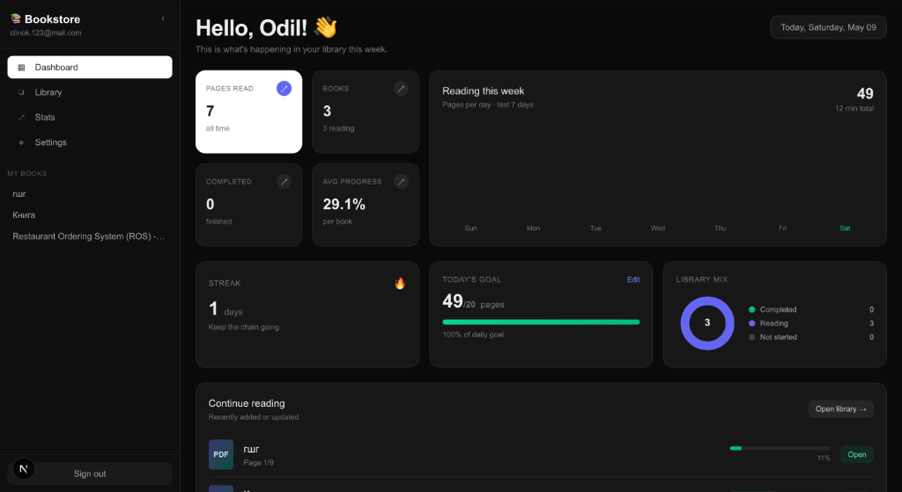
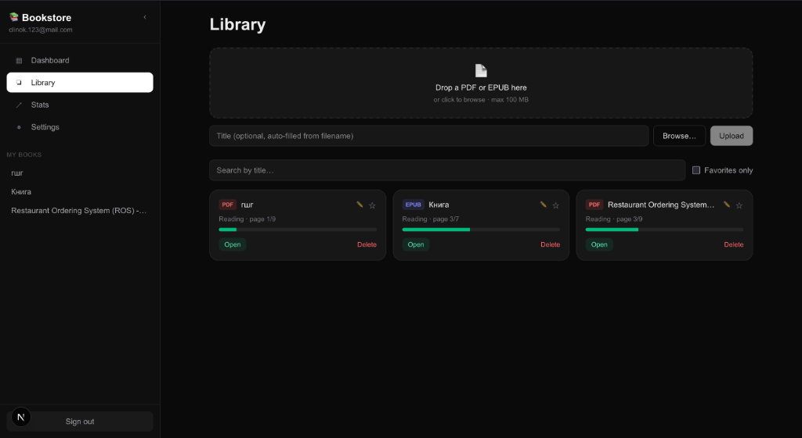
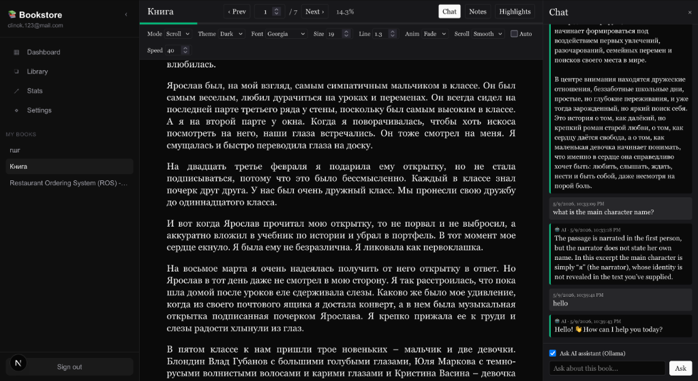
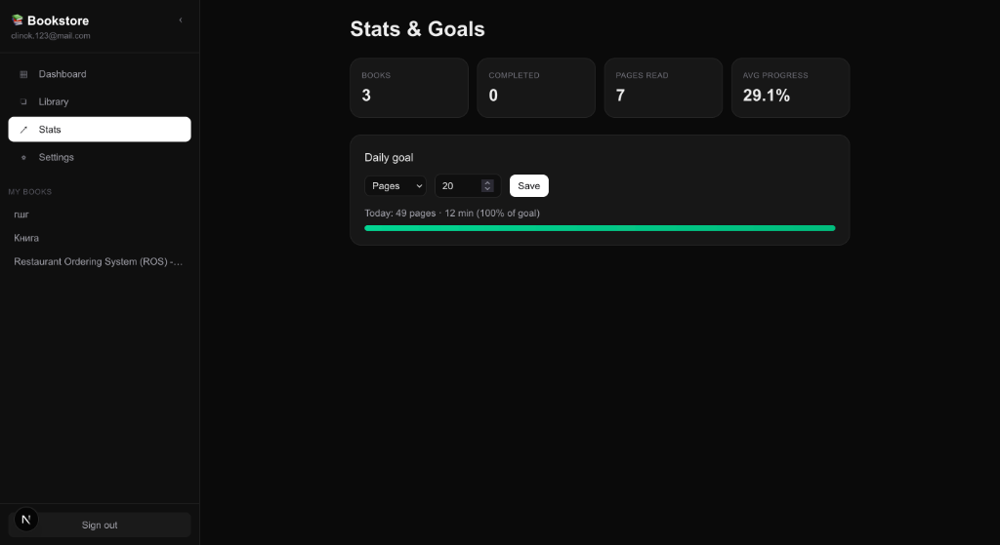
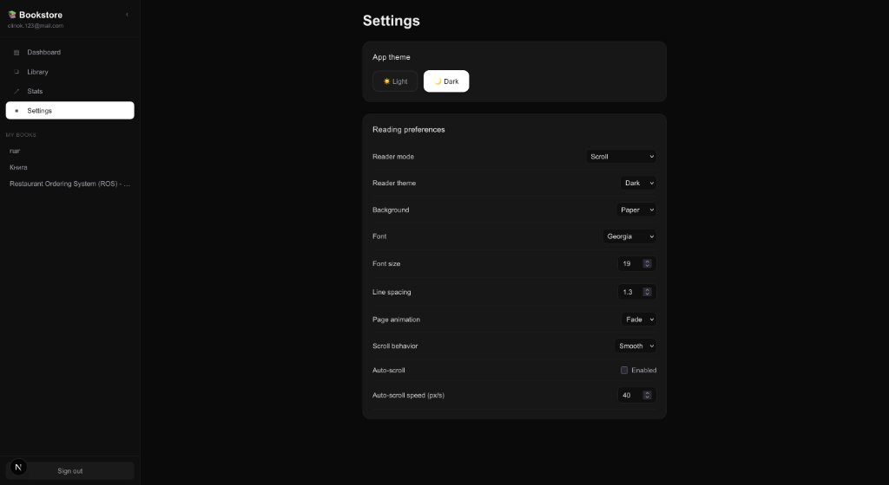

# 📚 Bookstore — Personal Reading App with AI Assistant

A full-stack web application for reading PDF and EPUB books in the browser, with notes, highlights, reading statistics, and a built-in AI assistant.

---

## 🎯 Problem & Motivation

Reading books online is fragmented — different apps, no sync, no unified notes. Most e-readers are paid or require external accounts. There's no easy way to ask questions about what you're reading without switching tabs. **Bookstore** solves this by putting everything in one place: your files, your notes, your AI assistant, and your reading history.

---

## ✨ Features

- 📄 **Upload & read PDF and EPUB** files (drag & drop, max 100 MB)
- 🔖 **Progress tracking** — auto-saved per book, resumable at any time
- 🌗 **Light / Dark theme** — across the entire app and inside the reader
- 🤖 **AI chat assistant** — ask questions about the book you're reading
- 📝 **Notes & Highlights** — per page, with color options
- ⭐ **Favorites & Search** — filter and organize your library
- ✏️ **Rename books** — inline editing from the library view
- 📊 **Statistics & daily goals** — track pages read, time spent, streaks
- 🔐 **Authentication** — secure register/login with bcrypt password hashing
- ⚙️ **Reader preferences** — font, size, line spacing, scroll/paged mode, auto-scroll

---

## 🖼️ Screenshots

### Dashboard


### Library


### Reader with AI Chat


### Stats & Goals


### Settings


---

## 🏗️ Architecture

```
Browser (React + Next.js)
       │
       ▼
Next.js API Routes  ──►  SQLite Database (via Prisma ORM)
       │
       ├──► File System  (uploads/<userId>/)
       │
       └──► OpenRouter API  (AI assistant)

Authentication: NextAuth v5 · JWT · httpOnly cookies
Route protection: middleware.ts
```

---

## 🛠️ Tech Stack

| Layer | Technology |
|-------|-----------|
| Framework | Next.js 15 (App Router) |
| UI | React 19, Tailwind CSS 4 |
| Language | TypeScript |
| Database | SQLite + Prisma ORM |
| Authentication | NextAuth v5 (Credentials + bcrypt) |
| PDF Rendering | pdfjs-dist + react-pdf |
| EPUB Parser | JSZip + @xmldom/xmldom (custom built) |
| AI Integration | OpenRouter API |
| File Storage | Local filesystem (`uploads/`) |

---

## 🗄️ Database Schema

| Model | Purpose |
|-------|---------|
| `User` | Account (email, passwordHash) |
| `Book` | Uploaded book metadata + file path |
| `Progress` | Current page, percentage, status per book |
| `Note` | User notes per page |
| `Highlight` | Text highlights with color per page |
| `Message` | AI chat history per book |
| `Favorite` | User–book favorites |
| `Goal` | Daily reading goal (pages or minutes) |
| `Preferences` | Reader settings per user |
| `ReadingEvent` | Reading sessions log for statistics |

---

## 🔌 API Endpoints

| Method | Path | Description |
|--------|------|-------------|
| GET/POST | `/api/books` | List books / upload new book |
| GET/PATCH/DELETE | `/api/books/[id]` | Get, rename, or delete a book |
| GET | `/api/books/[id]/epub` | Parsed EPUB content (chapters + inlined images) |
| GET | `/api/files/[id]` | Serve PDF file to browser |
| POST | `/api/books/[id]/progress` | Save reading progress |
| POST | `/api/books/[id]/favorite` | Toggle favorite |
| GET/POST/DELETE | `/api/books/[id]/notes` | Notes |
| GET/POST/DELETE | `/api/books/[id]/highlights` | Highlights |
| GET/POST | `/api/books/[id]/messages` | AI chat history |
| GET/PATCH | `/api/preferences` | Reader preferences |
| GET/PATCH | `/api/goal` | Daily reading goal |
| GET | `/api/stats` | Reading statistics |
| POST | `/api/ai/chat` | AI assistant query |
| POST | `/api/auth/register` | User registration |

---

## 🚀 Setup & Run

```bash
# 1. Clone the repository
git clone https://github.com/YOUR_USERNAME/bookstore-app.git
cd bookstore-app

# 2. Install dependencies
npm install

# 3. Create environment file
cp .env.example .env
# Edit .env and fill in:
#   DATABASE_URL="file:./prisma/dev.db"
#   NEXTAUTH_SECRET="any-random-string"
#   OPENROUTER_API_KEY="sk-..."   ← get free key at openrouter.ai

# 4. Initialize the database
npx prisma db push

# 5. Start the app
npm run dev
```

Open [http://localhost:3000](http://localhost:3000) — register an account and start uploading books.

Or use the one-line start script:
```bash
./run.sh
```

---

## 🎥 Demo Video

▶️ [Watch demo on Google Drive](https://drive.google.com/file/d/1UaIJvloZhc-OXjKcmuIzdJcaerCu9Qgt/view?usp=sharing)

---

## 👥 Faculty / Peer Feedback

🎤 [Watch feedback video on Google Drive](https://drive.google.com/file/d/1Q-9ybxMRV2_H-kgM9qE5c8HPASI8iKGu/view?usp=sharing)

---

## 📊 Presentation

The pitch presentation is available in the [`presentation/`](presentation/) folder.

---

## 🔒 Security Notes

- Passwords are stored as **bcrypt hashes** — never in plain text
- Every API route validates the user session — users can only access their own books
- EPUB HTML is **sanitized** on the server — all `<script>`, `<iframe>`, and inline event handlers are stripped before rendering
- File uploads are validated by **extension and size** (PDF/EPUB only, max 100 MB)
- Prisma uses **parameterized queries** — SQL injection is not possible
